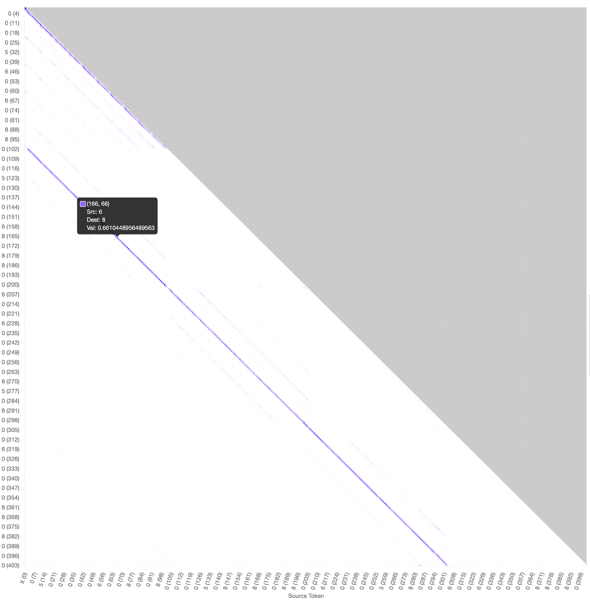
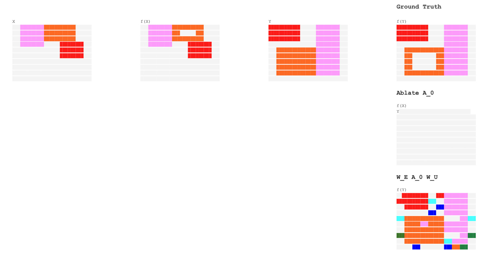
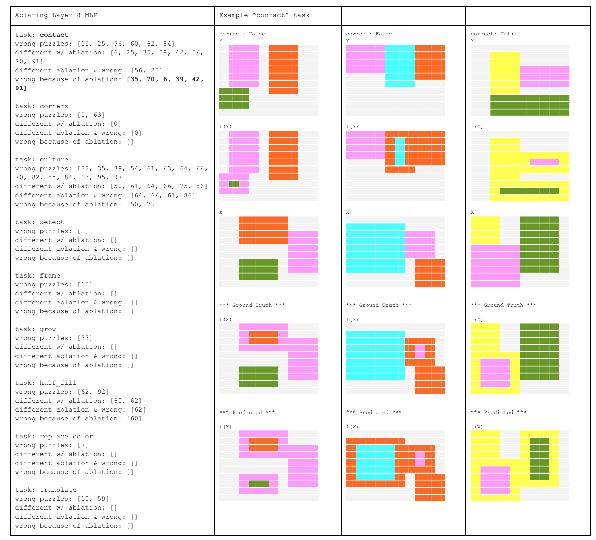
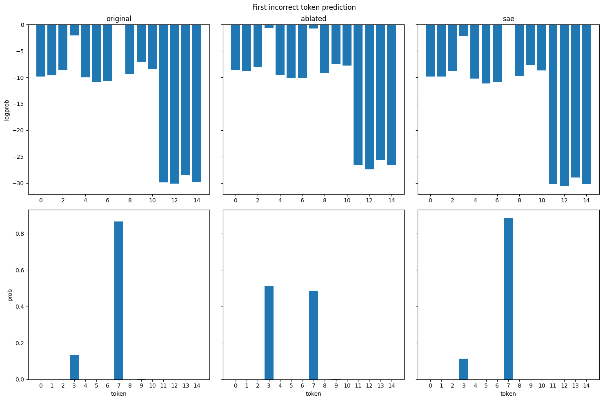
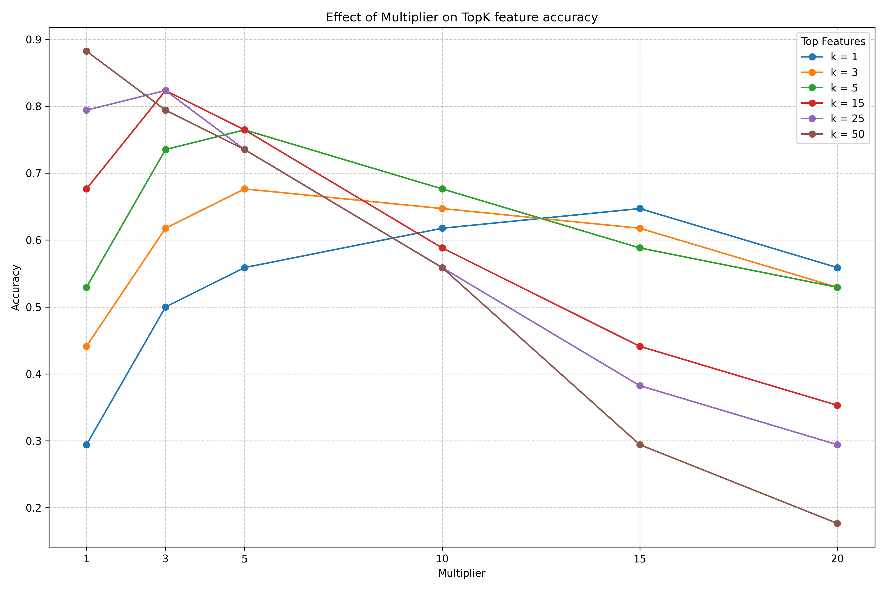
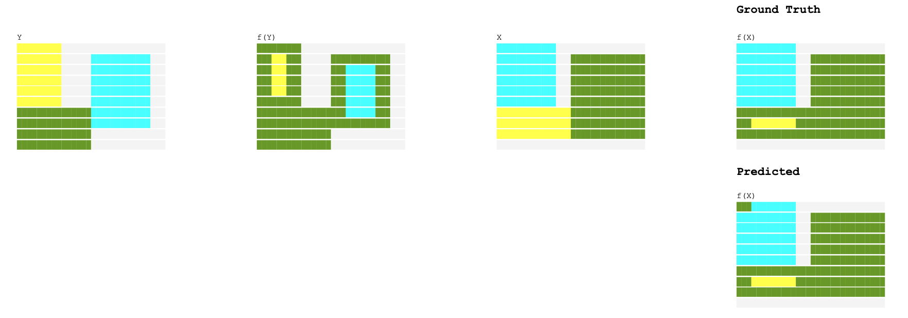

# MATS Report \-- Interpreting Culture

*This project builds upon [Francois Fleuret culture](http://fleuret.org/git/culture) (with his permission)*

- Repo: [https://github.com/tom-pollak/interpretability-culture](https://github.com/tom-pollak/interpretability-culture)
- HF: [https://huggingface.co/collections/tommyp111/culture-66c3463dff3d3581db9eabd2](https://huggingface.co/collections/tommyp111/culture-66c3463dff3d3581db9eabd2)

Logbooks:

- [01\_induction\_heads.pynb](https://nbviewer.org/github/tom-pollak/interpretability-culture/blob/main/01\_induction\_heads.ipynb)
- [02\_sae.pynb](https://nbviewer.org/github/tom-pollak/interpretability-culture/blob/main/02\_sae.ipynb)

## Background: The Culture project

[*https://fleuret.org/public/culture/draft-paper.pdf*](https://fleuret.org/public/culture/draft-paper.pdf)

François Fleuret's culture project hypothesis is that intelligence emerges from "social competition" among different agents. The experiment trains five 37M parameter GPTs on programmatically generated 2D "world" quizzes. Once the models achieve sufficient accuracy (\>95%), they generate their own "culture" quizzes, potentially producing progressively more difficult quizzes and unique concepts through social interaction.

## Motivation / why

From an interpretability perspective, this project offers several interesting aspects:

- Are there universal features shared across these models?
- Behaviour originating from specific tasks, possibly easier to interpret than language concepts
- Linear probes to search for a "world model" similar to the [Othello paper](https://thegradient.pub/othello/)
- Are there universal features shared across these models? [Universal Neurons in GPT2 Language Model](https://arxiv.org/abs/2401.12181)
- Fundamentally works the same as a standard LLM. I can use standard interpretability tools
- The visualizations of these grid tasks would look pretty cool.

## Problem outline

Integrating with the TransformerLens library presented some challenges:

- Conversion of bespoke MyGPT weights into a HookedTransformer
- Adding sinusoidal positional encoding support (not natively supported in TransformerLens)
- Patching to support a model without a final layer norm.

And some gotchas:

- `use_past_kv_cache` is buggy, probably due to the above hacks.
- Input must be prepended with a 0 as a `BOS` token
- For eval, only the final grid should be used

Find model weights [here](https://huggingface.co/collections/tommyp111/culture-66c3463dff3d3581db9eabd2)

## Finding Induction Circuits

When ablating attention layers, I found the first layer had an outsized impact on loss

```
Original: 2.84e-03
Ablate attn (layer 0\) diff: 2.65e+00 # 1000x loss!
Ablate attn (layer 1\) diff: 6.48e-03
Ablate attn (layer 2\) diff: 2.92e-03
Ablate attn (layer 3\) diff: 2.02e-03
Ablate attn (layer 4\) diff: 2.85e-03
Ablate attn (layer 5\) diff: 3.26e-03
Ablate attn (layer 6\) diff: 3.03e-03
Ablate attn (layer 7\) diff: 2.63e-03
Ablate attn (layer 8\) diff: 2.85e-03
Ablate attn (layer 9\) diff: 2.95e-03
Ablate attn (layer 10\) diff: 3.18e-03
Ablate attn (layer 11\) diff: 3.44e-03
```

### Jumping to conclusions

My first thoughts for this were:

- The first attention layer may function as a previous token circuit
- Disabling this layer causes the model to lose the ability to attend to the previous token

The most trivial method to optimize this problem is to copy grid $Y$ to $f(Y)$ with no transformations. I hypothesized that the first attention layer was a fixed distance induction circuit, copying the previous grid from 100 tokens away, requiring only a single attention head.

Attention patterns of layer 0 supported these conclusions, with head 0 showing the strongest indicator.  For the first 100 tokens (first grid) it would simply copy the previous token.


Figure 1: Attention pattern; Layer 0, head 0

Testing the effect of ablating layer 0 on the "frame" task (hollow out one rectangle in the grid into a "frame"). We'll compare the ground truth to:

- Zero ablation of attention layer 0
- Ablating every layer *but* attention layer 0


Figure 2: Interpreting Attention of Layer 0

#### Ablating `A_0`

Consistently predicts a special token directly after another special token, an *invalid board state*. I think this is predicted based on the more coarse positional encoding, since there is no lookback.

Zero padding is likely due to the model predicting common dataset statistics, where blank cells being most common.

#### End-to-end Induction Circuit with `A_0`

Induction heads are often called an "end-to-end circuit" mapping input directly to output logits. If the attention pattern writes directly into the output logit space, we can ablate *all* other layers & heads, and check if the output resembles the previous grid (essentially doing `W_E A_0 W_U`).

Results show a close (but imperfect) representation of the previous grid. While I think I could further refine this representation, it seems a fairly trivial task.

The more interesting cases lie in the 10% where the model does something different. This suggests that while later layers have a smaller impact on loss, investigating may be just as important and far more interesting.

## SAEs

I trained an SAE on the 8th layer MLP using a dataset of 1 million randomly generated tasks

Wandb run: [wandb.ai/tompollak/culture\_sae/runs/ri7d31tp](https://wandb.ai/tompollak/culture\_sae/runs/ri7d31tp?nw=nwusertompollak)

Training Results:

- Variance Explained: 85%
- L0 (%feature firings): 43
- L2 ratio: 0.48
- Dead features: 20%

I've never trained a Sparse Autoencoder before, and primarily used defaults provided from SAELens, so I'm not entirely sure how to interpret this. But 20% dead (3250 features) seems quite high.

I trained on layer 8 somewhat arbitrarily, let's see if we can find some interesting behaviour attributing to this MLP layer.

### Finding features

Testing accuracy when ablating layer 8 on individual tasks revealed it primarily impacted the "contact" task. When ablated, the model loses the ability to determine which rectangle should be ignored, instead encircling every rectangle while maintaining the correct encircled color.

- See Appendix 1 for reasoning of autoregressive sampling accuracy vs cross entropy loss



Figure 3: Effect of ablating layer 8 on "contact" task

I further investigated this with testing if a non-ablated model supplied with an initial incorrect token: it will continue with incorrect "encircling" behaviour, mirroring the behaviour of the ablated model.

Key findings:

- The model likely decides the behaviour on the first token
- Only the initial incorrect cell (now termed "**transform cell**") matters for interpreting this behaviour

Comparing correct and incorrect logit outputs of the transform cell:


Figure 4: Logit graph of transform cell

The correct output is 7, while ablating layer 8 MLP gives a slightly higher probability to 3\.

The SAE correctly reconstructs the original logit distribution. I'll now focus on finding the sparse features that cause reconstruct the behaviour, and experiment with the behaviour activating them in other scenarios.

### Interpreting SAE features

To identify the most important features, I initially considered activation/attribution patching, however determining what the clean and corrupted examples should be was not clear to me.

An example prompt to activation patching:

- Positive: "The Eiffel Tower is in \[Paris\]"
- Negative: "The Colosseum is in \[Rome\]"

We only have a single transform token and need to find the difference between the (correct) blank 0 token and the transform token.

Given these constraints, I tried two other approaches:

**Found the top 3 most activating SAE features from each example, grouped by count:**

`10024: 14, 16302: 9, 13557: 9, 9081: 8, 12657: 8, 13626: 7, 10175: 7, 1525: 4`

Feature 10024 appeared frequently with significantly higher activation.

**Developed an alternative to activation patching:** I wasn't certain measuring activation magnitude directly was the best way to interpret the most important features. So I also tried training a 1D "feature multiplier" that would mask feature weights that weren't important to reconstruction loss. I'm not sure if this is principled or correct, but it worked for me.

- Trained with reconstruction loss on the individual transform cell task.
- I initialize as a zero vector (equivalent of zero ablated)
- Very high weight decay (2) to keep most features at 0\.

Results: 12 features with weighting over 0.1, with feature 10024 most strongly weighted (0.666 vs. next highest 0.2989).

Now that I have somewhat strong evidence that 10024 is important for this circuit, I can test the feature importance with accuracy as before on the test dataset that the model would get incorrect with layer 8 zero ablated.

1) Ablating all features except 10024:
- Achieved 29.4% accuracy on previously incorrect tasks
- Hypothesized that zero-ablating other features reduced overall activation magnitude
2) Amplifying feature 10024:
- 15x magnitude multiplication achieved 64.7% accuracy
- Comparable to TopK 3 features with 5x multiplier (67.6% accuracy)
  - (This similarity may be coincidental, as features likely fire with different magnitudes)


Figure 5: TopK Feature Accuracy

With a small number of features I've found that I can recover much of the performance of the SAE, implying these features are important but may not be the only responsible components \-- other layers likely contain additional crucial features.

#### Attempting Model Steering

I attempted to induce contact behaviour on non-contact tasks by activating found features

1. Using a multiplier: No effect due to small incoming activations (suggesting earlier layers' importance)
2. Using a large constant: No effect, breaking models at large values

So while these features are important to the circuit, they are likely part of a larger circuit involving other layers.

## Next Steps

1. Identify contributing layers to the circuit:
- Ablate previous layers and look for similar behaviour patterns
- Find feature 10024 inputs from the residual stream and trace contributions from other layers
2. Continue exploring this circuit with more rigorous methods
- This is the first circuit I've attempted to "solve" by myself and I'm sure I've misinterpreted some of the results.
3. Train better SAEs on other layers, improving understanding of SAE training and interpretation
- My initial training of the SAE relied heavily on the predefined config from SAE Lens, and I need to read and learn more about training these. I found it hard to even interpret if my SAE was training correctly.

### Further Areas of Exploration

- Othello & Universal Neurons as specified in [Motivation / why](\#motivation-/-why)
- Universal Neurons:
  - In this work we could investigate the effect of coevolution in a group setting.
  - See Appendix 2 for the models creating their own "language" to communicate

## Appendices

### Appendix 1: Autoregressive Sampling Accuracy vs Cross Entropy Loss


Figure 6: Output of CEL

Top left predicts the initial incorrect "transform cell", but is corrected for later cells. Therefore loss can be uninformative of overall behaviour. I found accuracy in this example to be much more useful.

Using autoregressive sampling allows me to "quantify" the behaviour, letting the model spell out their original intention rather than getting corrected and revert to trivially copying.

### Appendix 2: Formal "language" the networks use to communicate

"There are initially few tasks, the two first grids mainly indicate the task identity, possibly with some instance-specific parameters, \[...\] most of the tasks' structures is likely encoded in the model parameters, and not extracted from the two first grids." \-- [Francois Fleuret](https://x.com/francoisfleuret/status/1815069436207919262)
